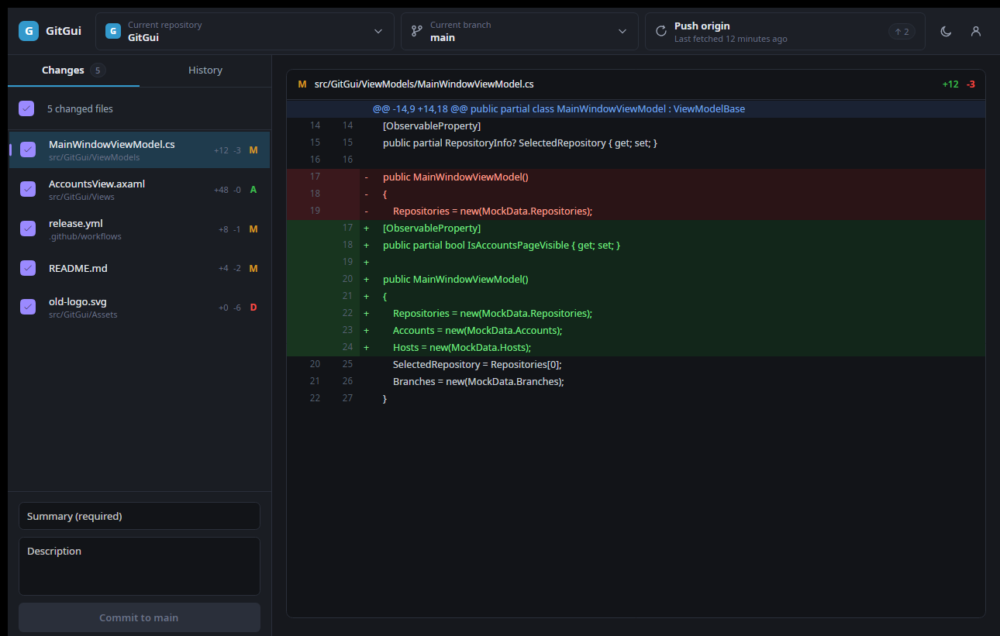
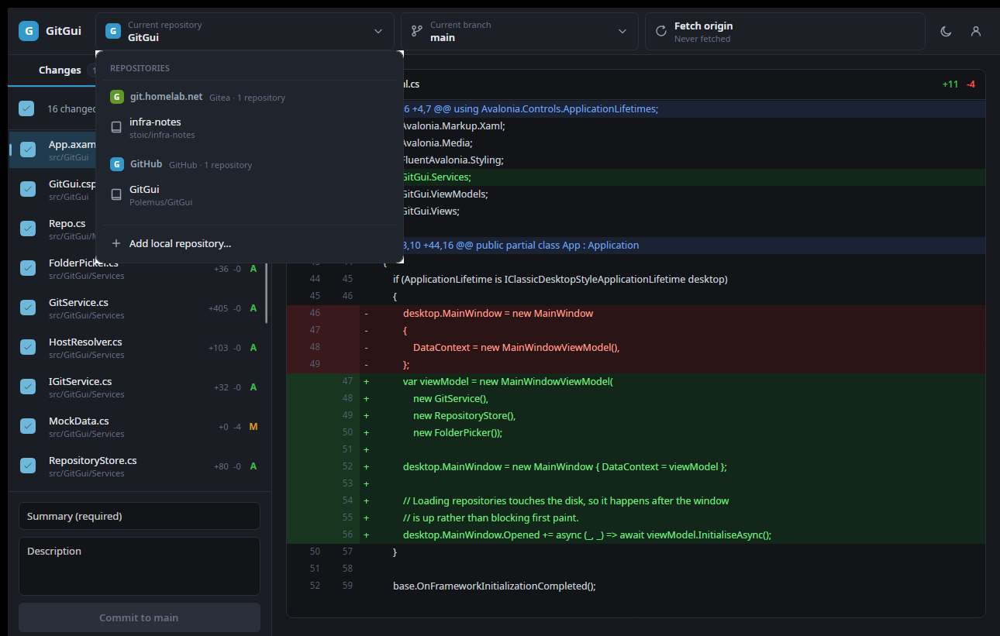
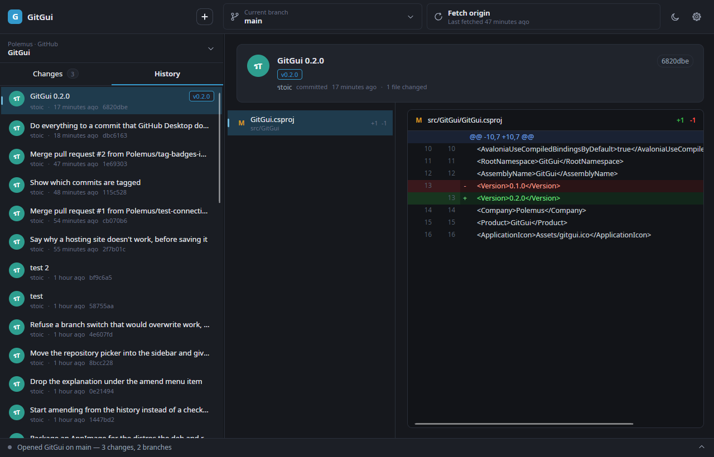
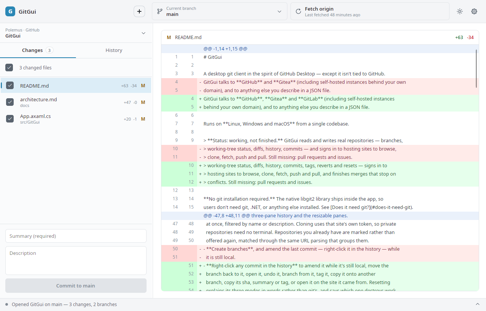

# GitGui

A desktop git client in the spirit of GitHub Desktop — except it isn't tied to GitHub.
GitGui talks to **GitHub** and **Gitea** (including self-hosted instances behind your own
domain), and to anything else you describe in a JSON file.

Runs on **Linux, Windows and macOS** from a single codebase.

> **Status: working, not finished.** GitGui reads and writes real repositories — branches,
> working-tree status, diffs, history, commits — and signs in to hosting sites to fetch,
> push and pull. Still missing: browsing and cloning remote repositories from the UI, and
> pull requests.

**No git installation required.** The native libgit2 library ships inside the app, so
users don't need git, .NET, or anything else installed. See [Does it need git?](#does-it-need-git).

---

## Screenshots

Every screenshot below is the app running against **real repositories** — including its
own. They predate the activity console, so the bar along the bottom is missing from them.

**Changes — working tree and unified diff**



**Repository picker — grouped by the hosting site each clone actually came from**



**History — commit list with per-file diffs**



**Light theme**



---

## What works

- **Add any local clone** through a native folder picker. The list persists between
  launches.
- **Repository picker grouped by hosting site.** The group a repo lands in is derived from its
  actual `origin` URL, so a GitHub clone and a self-hosted Gitea clone genuinely sort
  themselves apart. Handles `https://`, `ssh://` and scp-style `git@host:owner/repo`.
- **Branch picker** listing real local branches with their last-commit summaries, and
  switching branches actually checks out.
- **Changes tab** — real working-tree status covering modified, added, deleted, renamed
  and untracked files, each with its real diff. Untracked files get a synthetic
  all-added diff so they read like any other addition; binary and oversized files are
  detected and skipped rather than dumped as noise.
- **Commit** — tick the files you want, write a summary, commit. Staging is selective,
  deletions stage correctly, and the author comes from that repository's own git config.
- **History tab** — real commit log, with each commit's diffs loaded on demand
  (diffing 100 commits up front is far too slow for a list).
- **Diff viewer** — unified diff with dual line-number gutters, parsed from libgit2's
  patch output.
- **Ahead/behind** counts read from the branch's tracking details.
- **Dark and light themes**, switchable at runtime.
- **An activity console** docked at the bottom. Collapsed it shows the newest line with a
  severity dot; expanded it is a timestamped, colour-coded log that auto-scrolls. It
  expands itself when an error is logged, and carries trace output so a fetch or push
  shows what it is actually doing:

  ```
  14:22:01  Fetching origin from https://github.com/Polemus/GitGui.git
  14:22:02    30% — 41/136 objects, 82 KB
  14:22:03  Fetched from origin — already up to date
  ```

  Operations inform rather than fail. Being signed out returns a result, not an exception.

### Hosting sites are pluggable

Adding a new hosting site normally needs **no code**. You write a JSON file describing
the site's API — which URL lists repositories, which field holds the name — drop it in
`~/.config/GitGui/hosts/`, and restart. See **[docs/host-manifests.md](docs/host-manifests.md)**.

Manifests are data, not programs, so a site description can't execute anything or read
the tokens held for other sites. A plugin DLL could, which is why this isn't one.

| Site | How it's implemented |
| --- | --- |
| GitHub / GitHub Enterprise | C#, because its browser sign-in is a multi-step conversation |
| Gitea (and Forgejo) | a built-in manifest |
| GitLab | a built-in manifest |
| anything else | a manifest you write |

Gitea ships *as* a manifest deliberately: the format is exercised by GitGui's own code,
so it can't rot into something that only works in theory. Verified end-to-end against a
real Gitea 1.27 server — recognition, token sign-in, repository listing and credential
templating — including a hand-written third-party manifest.

### Signing in, fetching and pushing

Sign in on the Accounts screen with a personal access token, and fetch/push/pull work.
The sync button performs whatever its label says — pull when behind, push when ahead,
otherwise fetch — and sets the upstream on a branch's first push so you don't have to
drop to the command line for a branch you just created.

**Tokens go to the OS keychain**, never into a settings file:

| Platform | Where tokens are stored |
| --- | --- |
| Linux | system keyring via `secret-tool` (libsecret) |
| macOS | login Keychain via `security` |
| Windows | DPAPI, encrypted to your login |
| fallback | a `0600` file — the app says so plainly when it has to use this |

`accounts.json` holds only the harmless half (site, login, display name). Verified: the
token is present in the keyring and absent from the JSON.

Verified end-to-end against a real Gitea 1.27 server — sign in through the UI, then push
a commit whose remote URL carried no credentials, confirmed server-side.

### Not yet

- **GitHub browser sign-in needs an OAuth App client ID**, which identifies GitGui to
  GitHub and can't be invented. Register one (Settings → Developer settings → OAuth Apps,
  tick *Enable Device Flow*) and set `GITGUI_GITHUB_CLIENT_ID`. The button stays hidden
  until it is set. Personal access tokens work without any of that.
- **Browsing and cloning remote repositories.** The provider layer already lists them;
  the UI doesn't show them yet.
- **Pull requests and issues.**

## Does it need git?

**No.** LibGit2Sharp bundles native `libgit2` binaries, and because GitGui publishes
self-contained, they end up inside every installer. Users need no git, no .NET, nothing.
The bundled library covers every platform we ship: `linux-x64`, `linux-arm64`, `win-x64`,
`osx-arm64` and `osx-x64`.

One caveat for later, when remotes start being contacted: the bundled libgit2 registers
`git://`, `http://` and `https://`, but **not** `ssh://`. It supports SSH only via
`git_smart_subtransport_ssh_exec`, which shells out to a system `ssh` binary. So
`git@github.com:` remotes will need OpenSSH present — standard on macOS and Linux, an
optional feature on Windows. It still never needs git itself. Since both GitHub and Gitea
authenticate over HTTPS with tokens, HTTPS is the intended path.

## Tech stack

| Piece | Choice |
| --- | --- |
| UI framework | [Avalonia](https://avaloniaui.net) 12 |
| Controls / styling | [FluentAvalonia](https://github.com/amwx/FluentAvalonia) 3 (WinUI-flavoured Fluent) |
| MVVM | CommunityToolkit.Mvvm 8 (source-generated observables and commands) |
| Git | LibGit2Sharp 0.32 (bundles native libgit2) |
| Runtime | .NET 10 |

Avalonia renders with Skia rather than wrapping native controls, so the app looks and
behaves identically on all three platforms.

## Documentation

| Document | What's in it |
| --- | --- |
| [CLAUDE.md](CLAUDE.md) | Working notes: build commands, decisions not to re-litigate, gotchas already paid for, and what's next |
| [docs/architecture.md](docs/architecture.md) | The layers and *why* they're shaped this way |
| [docs/host-manifests.md](docs/host-manifests.md) | How to add a hosting site by writing one JSON file |

## Project layout

```
src/GitGui/
  Models/        Domain types — hosts, accounts, repos, commits, diffs
  Services/
    GitService.cs          libgit2 implementation of IGitService
    UnifiedDiffParser.cs   libgit2 patch text -> renderable diff rows
    HostResolver.cs        origin URL -> which hosting site a clone belongs to
    RepositoryStore.cs     known-clone list, JSON in the app-data dir
    FolderPicker.cs        native folder dialog via StorageProvider
    MockData.cs            design-time sample content only
  ViewModels/    MainWindowViewModel + per-item view models
  Views/         MainWindow, RepositoryView, DiffView, AccountsView
  Styles/        Tokens.axaml (theme colours + icons), Controls.axaml (control styles)
  Assets/        App icon
build/
  linux/         package.sh, .desktop entry, hicolor icons
  windows/       package.ps1, Inno Setup script
  macos/         package.sh, Info.plist template
.github/workflows/
  ci.yml         Linux build on push/PR
  release.yml    Full platform matrix, tag-triggered
```

All colours are defined once in `Styles/Tokens.axaml`, per theme variant, and referenced
with `DynamicResource`. To restyle the app, that's the only file you need.

## Running it

Needs the [.NET 10 SDK](https://dotnet.microsoft.com/download).

```bash
dotnet run --project src/GitGui/GitGui.csproj
```

In VS Code, <kbd>F5</kbd> works via the checked-in `.vscode/launch.json`. (If you press
F5 with a `.axaml` file focused *before* that config exists, VS Code offers to find an
"Avalonia XAML debugger" — decline it; no such extension is needed.)

## Building installers

Each script publishes a **self-contained** build, so end users don't need .NET installed.

```bash
# Linux — .deb, .rpm and .tar.gz  (needs fpm: gem install fpm)
./build/linux/package.sh linux-x64 0.1.0
./build/linux/package.sh linux-arm64 0.1.0

# macOS — .app bundle inside a .dmg  (run on macOS)
./build/macos/package.sh osx-arm64 0.1.0

# Windows — portable .zip and an Inno Setup installer
pwsh build/windows/package.ps1 -Rid win-x64 -Version 0.1.0
```

Artifacts land in `dist/`.

## Releasing

Tag and push:

```bash
git tag v0.1.0
git push origin v0.1.0
```

`release.yml` then builds every target and attaches the results to a GitHub Release:

| Platform | Artifacts |
| --- | --- |
| Linux x64 / arm64 | `.deb`, `.rpm`, `.tar.gz` |
| Windows x64 | `-setup.exe`, `.zip` |
| macOS arm64 / x64 | `.dmg` |

You can also run it manually from the Actions tab and pass a version.

**On Actions minutes:** this repo is private, so minutes are billed — and macOS runners
bill at 10x. The release workflow therefore runs **only** on tags or manual dispatch, and
cross-publishes both Linux RIDs from one Linux runner and both macOS RIDs from one macOS
runner. That's 3 jobs instead of 5. Everyday CI is Linux-only and build-only.

## Known gaps

- **Network operations.** Fetch/push/pull, plus the GitHub OAuth device flow, Gitea PAT
  entry and secure token storage. This is the next phase.
- **Non-GitHub hosts are assumed to be Gitea.** `HostResolver` classifies anything that
  isn't `github.com` as Gitea without checking. Confirming it by probing
  `/api/v1/version` comes with the API work.
- **History is capped at 100 commits** with no paging yet.
- **macOS builds are unsigned.** Gatekeeper will complain on first launch — right-click →
  Open. Signing and notarisation need an Apple Developer account.
- **Installers are ~45 MB** because each build bundles the .NET runtime. Enabling
  `PublishTrimmed` would cut that substantially, but Avalonia needs trimming feed
  configuration and `ViewLocator`'s reflection would have to go first.
- **AppImage / Flatpak** aren't built yet; the `.tar.gz` covers distros without `.deb`
  or `.rpm` for now.

## Licence

MIT — see [LICENSE](LICENSE).
