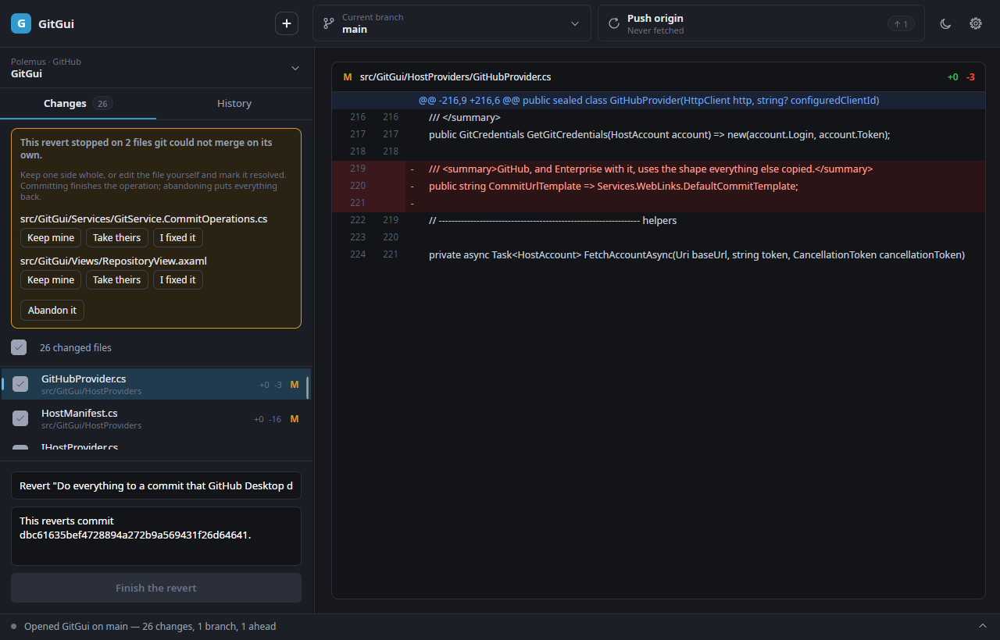

# GitGui

A desktop git client in the spirit of GitHub Desktop — except it isn't tied to GitHub.
GitGui talks to **GitHub**, **Gitea** and **GitLab** (including self-hosted instances
behind your own domain), and to anything else you describe in a JSON file.

Runs on **Linux, Windows and macOS** from a single codebase.

> **Status: working, not finished.** GitGui reads and writes real repositories — branches,
> working-tree status, diffs, history, commits, tags, reverts and resets — signs in to
> hosting sites to browse, clone, fetch, push and pull, and finishes merges that stop on
> conflicts. Still missing: pull requests and issues.

**No git installation required.** The native libgit2 library ships inside the app, so
users don't need git, .NET, or anything else installed. See [Does it need git?](#does-it-need-git).

---

## Screenshots

Every screenshot below is the app running against **real repositories** — including its
own. The one at the top is GitGui showing the edit to this very README.

**Changes — working tree and unified diff**


**History — three panes, with tags shown against the commits that carry them**


**Finishing a revert that stopped on conflicts** — each file gets three answers, the
commit box is pre-filled with the message git prepared, and committing stays disabled
until nothing is conflicted



**Repository picker — grouped by the hosting site each clone actually came from**


**Light theme**


---

## What works

- **Add any local clone** through a native folder picker, from the **+** in the header.
  The list persists between launches.
- **Browse and clone** everything your signed-in accounts can see, from every hosting site
  at once, filtered by name or description. Cloning uses that site's own token, so private
  repositories need no terminal. Repositories you already have are marked rather than
  offered again, matched through the same URL parsing that groups them.
- **Right-click any commit in the history** to amend it while it's still local, move the
  branch back to it, open it, undo it, branch from it, tag it, copy it onto another
  branch, copy its sha, summary or tag, or open it on the site it came from. Resetting
  explains its three modes in words rather than git's, and says which one destroys work.
- **Create branches**, from the branch picker or from any commit in the history.
- **Switching branches with uncommitted work asks first** rather than silently carrying it
  across. Bring everything, leave everything, or tick individual files — whatever is left
  behind is stashed against the branch you came from. Returning to that branch shows a bar
  above the commit box offering to restore it. A file that has also changed on the branch
  you're heading to can't be carried across at all — that's refused with the file named,
  and nothing is moved, rather than failing part-way.
- **Repository picker grouped by hosting site.** The group a repo lands in is derived from its
  actual `origin` URL, so a GitHub clone and a self-hosted Gitea clone genuinely sort
  themselves apart. Handles `https://`, `ssh://` and scp-style `git@host:owner/repo`.
- **Branch picker** listing real local branches with their last-commit summaries, and
  switching branches actually checks out.
- **Changes tab** — real working-tree status covering modified, added, deleted, renamed
  and untracked files, each with its real diff. Untracked files get a synthetic
  all-added diff so they read like any other addition; binary and oversized files are
  detected and skipped rather than dumped as noise.
- **Commit** — tick the files you want, write a summary, commit. Staging is selective,
  deletions stage correctly, and the author comes from that repository's own git config.
- **Right-click a changed file** to discard it, add it to `.gitignore` (the file, its
  folder or its extension — only the ones that apply to that file are offered), copy its
  path, or open its folder. Discarding asks first, since nothing can bring it back.
- **History tab** — real commit log in three panes, with each commit's diffs loaded on
  demand (diffing 100 commits up front is far too slow for a list). Selecting a commit
  shows its header, the files it touched, and the diff for whichever file you click.
  Tagged commits carry their tag names as badges in the list.
- **Conflicts are finished in the app.** When a merge, revert or cherry-pick stops on
  something git can't merge itself, a panel on the Changes tab lists what's stuck and
  offers each file three answers: keep mine, take theirs, or fix it by hand and mark it
  resolved. Committing finishes the operation, using the message git prepared; abandoning
  puts everything back. Committing is blocked until nothing is conflicted, so markers
  can't reach a commit by accident.
- **Resizable panes.** The sidebar, the commit file list and the activity console are all
  draggable, and the console remembers its height across collapsing.
- **Refreshes itself.** A debounced file-system watcher notices work done outside the app,
  so committing in a terminal or saving in an editor updates the view without a restart.
  An automatic refresh keeps your ticked files and selection, since you didn't ask for it.
- **Diff viewer** — unified diff with dual line-number gutters, parsed from libgit2's
  patch output.
- **Ahead/behind** counts read from the branch's tracking details.
- **Dark and light themes**, switchable at runtime.
- **An activity console** docked at the bottom. Collapsed it shows the newest line with a
  severity dot; expanded it is a timestamped, colour-coded log that auto-scrolls. It
  expands itself when an error is logged, and carries trace output so a fetch or push
  shows what it is actually doing:

  ```
  14:22:01  Fetching origin from https://github.com/Polemus/GitGui.git
  14:22:02    30% — 41/136 objects, 82 KB
  14:22:03  Fetched from origin — already up to date
  ```

  Operations inform rather than fail. Being signed out returns a result, not an exception.

### Hosting sites are pluggable

Adding a new hosting site needs **no code**. **Settings → Hosting sites → Add a site**
walks you through it — which URL lists repositories, which field holds the name — and the
site is usable immediately, without a restart. Gitea-shaped and GitLab-shaped starting
points are offered, since those two differ enough that one set of defaults won't do.

What that form writes is an ordinary JSON file in `~/.config/GitGui/hosts/`, identical to
one you'd write by hand and editable afterwards. The file stays the source of truth. See
**[docs/host-manifests.md](docs/host-manifests.md)** for the format.

Manifests are data, not programs, so a site description can't execute anything or read
the tokens held for other sites. A plugin DLL could, which is why this isn't one.

| Site | How it's implemented |
| --- | --- |
| GitHub / GitHub Enterprise | C#, because its browser sign-in is a multi-step conversation |
| Gitea (and Forgejo) | a built-in manifest |
| GitLab | a built-in manifest |
| anything else | a manifest you write |

Gitea ships *as* a manifest deliberately: the format is exercised by GitGui's own code,
so it can't rot into something that only works in theory. Verified end-to-end against a
real Gitea 1.27 server — recognition, token sign-in, repository listing and credential
templating — including a hand-written third-party manifest.

### Signing in, fetching and pushing

Sign in under **Settings → Accounts** — **"Sign in with browser"** on github.com, which shows you
a code to type into GitHub and waits for approval, or a personal access token anywhere —
and fetch/push/pull work. GitHub Enterprise has no browser button until you register an
OAuth App on that server (Settings → Developer settings → OAuth Apps, tick *Enable Device
Flow*) and set `GITGUI_GITHUB_CLIENT_ID`; a token works there without any of that.

The sync button performs whatever its label says — pull when behind, push when ahead,
otherwise fetch — and sets the upstream on a branch's first push so you don't have to
drop to the command line for a branch you just created.

**Tokens go to the OS keychain**, never into a settings file:

| Platform | Where tokens are stored |
| --- | --- |
| Linux | system keyring via `secret-tool` (libsecret) |
| macOS | login Keychain via `security` |
| Windows | DPAPI, encrypted to your login |
| fallback | a `0600` file — the app says so plainly when it has to use this |

`accounts.json` holds only the harmless half (site, login, display name). Verified: the
token is present in the keyring and absent from the JSON.

Verified end-to-end against a real Gitea 1.27 server — sign in through the UI, then push
a commit whose remote URL carried no credentials, confirmed server-side.

### Not yet

- **Pull requests and issues.**

## Does it need git?

**No.** LibGit2Sharp bundles native `libgit2` binaries, and because GitGui publishes
self-contained, they end up inside every installer. Users need no git, no .NET, nothing.
The bundled library covers every platform we ship: `linux-x64`, `linux-arm64`, `win-x64`,
`osx-arm64` and `osx-x64`.

One caveat: the bundled libgit2 registers
`git://`, `http://` and `https://`, but **not** `ssh://`. It supports SSH only via
`git_smart_subtransport_ssh_exec`, which shells out to a system `ssh` binary. So
`git@github.com:` remotes will need OpenSSH present — standard on macOS and Linux, an
optional feature on Windows. It still never needs git itself. Since both GitHub and Gitea
authenticate over HTTPS with tokens, HTTPS is the intended path.

## Tech stack

| Piece | Choice |
| --- | --- |
| UI framework | [Avalonia](https://avaloniaui.net) 12 |
| Controls / styling | [FluentAvalonia](https://github.com/amwx/FluentAvalonia) 3 (WinUI-flavoured Fluent) |
| MVVM | CommunityToolkit.Mvvm 8 (source-generated observables and commands) |
| Git | LibGit2Sharp 0.32 (bundles native libgit2) |
| Runtime | .NET 10 |

Avalonia renders with Skia rather than wrapping native controls, so the app looks and
behaves identically on all three platforms.

## Documentation

| Document | What's in it |
| --- | --- |
| [docs/architecture.md](docs/architecture.md) | The layers and *why* they're shaped this way |
| [docs/host-manifests.md](docs/host-manifests.md) | How to add a hosting site by writing one JSON file |

## Project layout

```
src/GitGui/
  Models/        Domain types — hosts, accounts, repos, commits, diffs
  Services/
    GitService.cs          libgit2 implementation of IGitService
    GitService.CommitOperations.cs
                           tags, reverts, cherry-picks, resets and conflicts
    UnifiedDiffParser.cs   libgit2 patch text -> renderable diff rows
    HostResolver.cs        origin URL -> which hosting site a clone belongs to
    WebLinks.cs            clone + commit -> the page to open in a browser
    AccountStore.cs        accounts split between JSON and the keyring
    CredentialStore.cs     keyring / Keychain / DPAPI, with a 0600 fallback
    ActivityLog.cs         what the console shows
    RepositoryStore.cs     known-clone list, JSON in the app-data dir
    RepositoryWatcher.cs   notices work done outside the app, debounced
    FolderPicker.cs        native folder dialog via StorageProvider
    SystemShell.cs         open a browser, reach the clipboard
    MockData.cs            design-time sample content only
  ViewModels/    MainWindowViewModel + per-item view models and prompts
  Views/         MainWindow, RepositoryView, DiffView, CloneView, SettingsView
  Styles/        Tokens.axaml (theme colours + icons), Controls.axaml (control styles)
  Assets/        App icon
tests/GitGui.Tests/
                 xunit — pure functions, plus branch switching, commit operations
                 and conflicts against real throwaway repositories. See "Tests".
build/
  linux/         package.sh, .desktop entry, hicolor icons
  windows/       package.ps1, Inno Setup script
  macos/         package.sh, Info.plist template
.github/workflows/
  ci.yml         Linux build on push/PR
  release.yml    Full platform matrix, tag-triggered
```

All colours are defined once in `Styles/Tokens.axaml`, per theme variant, and referenced
with `DynamicResource`. To restyle the app, that's the only file you need.

## Running it

Needs the [.NET 10 SDK](https://dotnet.microsoft.com/download).

```bash
dotnet run --project src/GitGui/GitGui.csproj
```

In VS Code, <kbd>F5</kbd> works via the checked-in `.vscode/launch.json`. (If you press
F5 with a `.axaml` file focused *before* that config exists, VS Code offers to find an
"Avalonia XAML debugger" — decline it; no such extension is needed.)

## Tests

```bash
dotnet test
```

Some cover the pure functions, which are the parts that break silently: the unified-diff
parser, the remote-URL resolution behind repository grouping, the commit-link builder, and
the manifest field mapping — including the round trip through the settings form, since a
lost field there would quietly mislabel every repository on a site.

The rest run against **real repositories** created in a temp directory, because what makes
them worth writing is what libgit2 actually leaves behind:

- **Branch switching.** Carrying only some uncommitted files across a checkout takes two
  stashes and six steps, and a mistake there loses work that was never committed — the one
  place in this codebase where a bug is unrecoverable, so it is verified rather than
  reasoned about.
- **Commit operations.** Tagging, branching from an older commit, detaching onto a commit,
  reverting, cherry-picking and all three reset modes — each asserted on the state left in
  the repository, including the half-applied ones.
- **Conflicts.** Keeping either side, marking resolved by hand, finishing with a commit and
  abandoning outright, each checked against the index rather than the working tree.

LibGit2Sharp bundles its own native library, so none of this needs git installed.

Nothing here talks to the network or the UI. Those are still checked by hand against a real
Gitea server — see the docker one-liner in [docs/architecture.md](docs/architecture.md).

## Building installers

Each script publishes a **self-contained** build, so end users don't need .NET installed.

```bash
# Linux — .deb, .rpm, .tar.gz and .AppImage  (needs fpm: gem install fpm)
./build/linux/package.sh linux-x64 0.2.0
./build/linux/package.sh linux-arm64 0.2.0

# macOS — .app bundle inside a .dmg  (run on macOS)
./build/macos/package.sh osx-arm64 0.2.0

# Windows — portable .zip and an Inno Setup installer
pwsh build/windows/package.ps1 -Rid win-x64 -Version 0.2.0
```

Artifacts land in `dist/`.

The AppImage is built by `build/linux/appimage.sh`, which `package.sh` calls once the
publish is staged. `appimagetool` and the AppImage runtime are downloaded on first use and
cached in `build/.tools/`; without network access that step is skipped and the other three
artifacts are still produced. Run the script on its own to rebuild only the AppImage —
it reuses whatever `package.sh` last staged instead of publishing again:

```bash
./build/linux/appimage.sh linux-x64 0.2.0
```

The architecture of the output comes from the runtime handed to `appimagetool`, not from
the machine running it, so the arm64 AppImage cross-builds from an x64 runner like the
rest of the Linux artifacts.

## Releasing

Tag and push:

```bash
git tag -a v0.2.0 -m "GitGui 0.2.0"
git push origin v0.2.0
```

`release.yml` runs the tests first — `ci.yml` only triggers on pushes to a branch, so
without that gate a tag would package untested code — then builds every target and
attaches the results to a GitHub Release:

| Platform | Artifacts |
| --- | --- |
| Linux x64 / arm64 | `.deb`, `.rpm`, `.tar.gz`, `.AppImage` |
| Windows x64 | `-setup.exe`, `.zip` |
| macOS arm64 / x64 | `.dmg` |

You can also run it manually from the Actions tab and pass a version.

**On Actions minutes:** this repo is private, so minutes are billed — and macOS runners
bill at 10x. The release workflow therefore runs **only** on tags or manual dispatch, and
cross-publishes both Linux RIDs from one Linux runner and both macOS RIDs from one macOS
runner. That's 3 jobs instead of 5. Everyday CI is Linux-only and build-only.

## Known gaps

- **Repository grouping assumes non-GitHub means Gitea.** `HostResolver` classifies any
  remote that isn't `github.com` as Gitea to pick a badge and colour for the sidebar. Sign-in
  does not work this way — that probes the server properly — so the consequence is a
  mislabelled group, not a failed connection.
- **No reordering commits, and no reflog rescue.** Everything else in GitHub Desktop's
  commit menu is there, but reordering needs an interactive rebase, and libgit2 has no
  todo-list rebase to drive — it would mean replaying commit by commit with conflict
  handling at every step.
- **Tests stop at the git layer.** The pure functions and everything that touches a
  repository are covered; the network and the whole UI are still verified by hand,
  against a real Gitea server.
- **History is capped at 100 commits** with no paging yet.
- **macOS builds are unsigned.** Gatekeeper will complain on first launch — right-click →
  Open. Signing and notarisation need an Apple Developer account.
- **Installers are ~45 MB** because each build bundles the .NET runtime. Enabling
  `PublishTrimmed` would cut that substantially, but Avalonia needs trimming feed
  configuration and `ViewLocator`'s reflection would have to go first.
- **No Flatpak.** The `.AppImage` covers distros without `.deb` or `.rpm`. It carries no
  AppStream metainfo yet, so it won't show up with a description in software centres that
  index AppImages.

## Licence

MIT — see [LICENSE](LICENSE).
