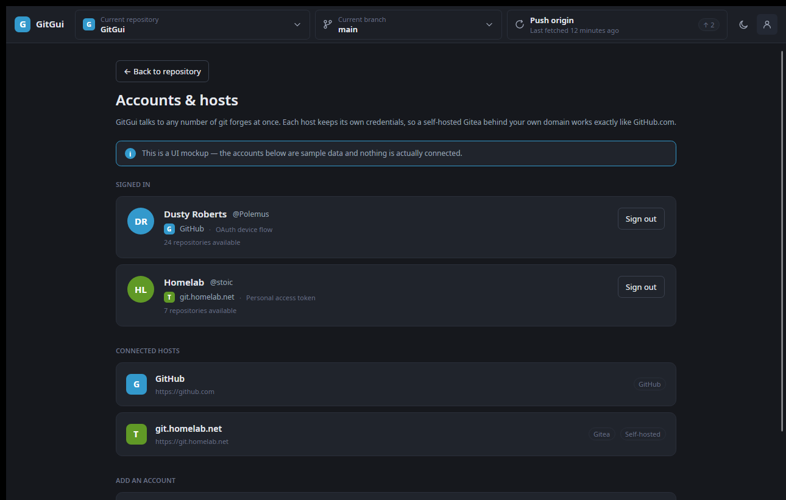

# GitGui

A desktop git client in the spirit of GitHub Desktop — except it isn't tied to GitHub.
GitGui talks to **GitHub** and **Gitea** (including self-hosted instances behind your own
domain), with room for more forges later.

Runs on **Linux, Windows and macOS** from a single codebase.

> **Status: UI mockup.** The interface is complete and clickable, but nothing touches a
> repository on disk yet — every repo, branch, commit and diff you see is sample data.
> The point is to settle the design before wiring up real git.

---

## Screenshots

**Changes — working tree and unified diff**


**History — commit list with per-file diffs**


**Accounts & hosts — the multi-forge story**



**Light theme**


---

## What's in the mockup

- **Repository picker** grouped by host, so a GitHub repo and a self-hosted Gitea repo sit
  side by side in one list.
- **Branch picker** with last-commit summaries.
- **Sync button** that reads `Fetch` / `Push` / `Pull` depending on ahead/behind counts.
- **Changes tab** — stageable file list, per-file add/delete counts, commit box with a
  summary/description and a `Commit to <branch>` button that enables only when valid.
- **History tab** — commit list, commit detail card, and the diffs for that commit.
- **Diff viewer** — unified diff with dual line-number gutters and add/remove/hunk styling.
- **Accounts & hosts** — signed-in identities per forge, connected host list, and the
  entry points for adding GitHub.com, GitHub Enterprise or a self-hosted Gitea.
- **Dark and light themes**, switchable at runtime from the toolbar.

## Tech stack

| Piece | Choice |
| --- | --- |
| UI framework | [Avalonia](https://avaloniaui.net) 12 |
| Controls / styling | [FluentAvalonia](https://github.com/amwx/FluentAvalonia) 3 (WinUI-flavoured Fluent) |
| MVVM | CommunityToolkit.Mvvm 8 (source-generated observables and commands) |
| Runtime | .NET 10 |

Avalonia renders with Skia rather than wrapping native controls, so the app looks and
behaves identically on all three platforms.

## Project layout

```
src/GitGui/
  Models/        Domain types — hosts, accounts, repos, commits, diffs
  Services/      MockData.cs — all sample content lives here
  ViewModels/    MainWindowViewModel + per-item view models
  Views/         MainWindow, RepositoryView, DiffView, AccountsView
  Styles/        Tokens.axaml (theme colours + icons), Controls.axaml (control styles)
  Assets/        App icon
build/
  linux/         package.sh, .desktop entry, hicolor icons
  windows/       package.ps1, Inno Setup script
  macos/         package.sh, Info.plist template
.github/workflows/
  ci.yml         Linux build on push/PR
  release.yml    Full platform matrix, tag-triggered
```

All colours are defined once in `Styles/Tokens.axaml`, per theme variant, and referenced
with `DynamicResource`. To restyle the app, that's the only file you need.

## Running it

Needs the [.NET 10 SDK](https://dotnet.microsoft.com/download).

```bash
dotnet run --project src/GitGui/GitGui.csproj
```

In VS Code, <kbd>F5</kbd> works via the checked-in `.vscode/launch.json`. (If you press
F5 with a `.axaml` file focused *before* that config exists, VS Code offers to find an
"Avalonia XAML debugger" — decline it; no such extension is needed.)

## Building installers

Each script publishes a **self-contained** build, so end users don't need .NET installed.

```bash
# Linux — .deb, .rpm and .tar.gz  (needs fpm: gem install fpm)
./build/linux/package.sh linux-x64 0.1.0
./build/linux/package.sh linux-arm64 0.1.0

# macOS — .app bundle inside a .dmg  (run on macOS)
./build/macos/package.sh osx-arm64 0.1.0

# Windows — portable .zip and an Inno Setup installer
pwsh build/windows/package.ps1 -Rid win-x64 -Version 0.1.0
```

Artifacts land in `dist/`.

## Releasing

Tag and push:

```bash
git tag v0.1.0
git push origin v0.1.0
```

`release.yml` then builds every target and attaches the results to a GitHub Release:

| Platform | Artifacts |
| --- | --- |
| Linux x64 / arm64 | `.deb`, `.rpm`, `.tar.gz` |
| Windows x64 | `-setup.exe`, `.zip` |
| macOS arm64 / x64 | `.dmg` |

You can also run it manually from the Actions tab and pass a version.

**On Actions minutes:** this repo is private, so minutes are billed — and macOS runners
bill at 10x. The release workflow therefore runs **only** on tags or manual dispatch, and
cross-publishes both Linux RIDs from one Linux runner and both macOS RIDs from one macOS
runner. That's 3 jobs instead of 5. Everyday CI is Linux-only and build-only.

## Known gaps

- **No real git yet.** Wiring up [LibGit2Sharp](https://github.com/libgit2/libgit2sharp)
  behind the interfaces implied by `MockData` is the next step.
- **macOS builds are unsigned.** Gatekeeper will complain on first launch — right-click →
  Open. Signing and notarisation need an Apple Developer account.
- **Installers are ~45 MB** because each build bundles the .NET runtime. Enabling
  `PublishTrimmed` would cut that substantially, but Avalonia needs trimming feed
  configuration and `ViewLocator`'s reflection would have to go first.
- **AppImage / Flatpak** aren't built yet; the `.tar.gz` covers distros without `.deb`
  or `.rpm` for now.

## Licence

MIT — see [LICENSE](LICENSE).
